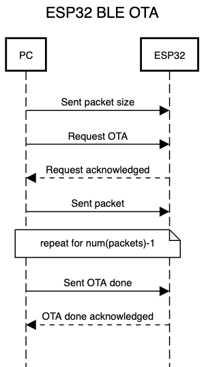
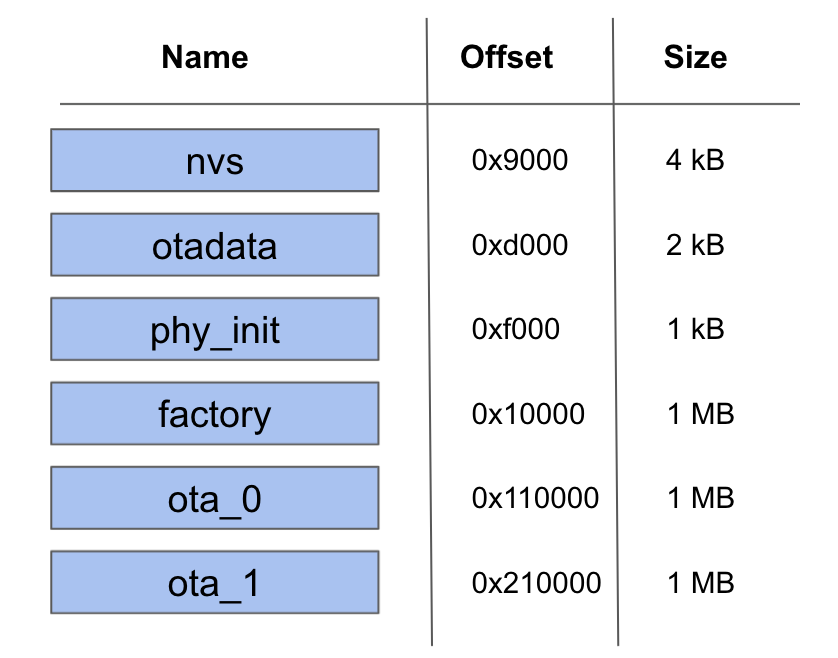
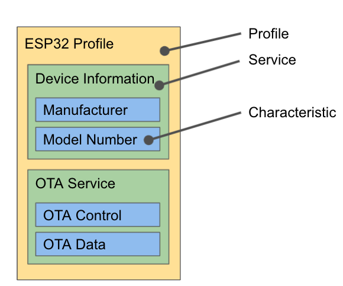

# esp32-ble-ota

ESP32 BLE OTA boilerplate created with ESP-IDF v4.4.1 and the NimBLE stack.

## BLE API Reference

#### OTA Service `d6f1d96d-594c-4c53-b1c6-244a1dfde6d8`

#### OTA Control

| UUID                                   | Type     | Description      |
| :------------------------------------- | :------- | :--------------- |
| `7ad671aa-21c0-46a4-b722-270e3ae3d830` | `notify` | Control response |
| `7ad671aa-21c0-46a4-b722-270e3ae3d830` | `read`   | Control response |
| `7ad671aa-21c0-46a4-b722-270e3ae3d830` | `write`  | Control requests |

#### OTA Data

| UUID                                   | Type    | Description   |
| :------------------------------------- | :------ | :------------ |
| `23408888-1f40-4cd8-9b89-ca8d45f8a5b0` | `write` | Send OTA Data |

## Documentation

### Over-the-Air Update Process

During the GAP connection process, the APP and ESP32 negotiate the maximum MTU size. The packet size is calculated based on the MTU size minus 3 bytes for ATT-related overhead. The APP writes the packet size to the OTA Data characteristic. The OTA process kicks off when the APP sends an OTA request to the OTA Control characteristic, to which the ESP32 responds with an acknowledgement.

### ESP32 code

The server-side is implemented using the NimBLE stack. It is the from Espressif recommended way if you are only using BLE. We will create the GATT service table containing all necessary characteristics, set the access flags, and implement access callbacks for each characteristic. These callbacks are pieces of code that NimBLE calls once a client tries to read or write to one of the characteristics.

The ESP32 source code consists of 3 files: main.c, gap.c, and gatt_svr.c.

### Partition Table

The nvs partition is used for a simple key-value storage for user data. You can use the non-volatile storage library to save your own data. Many external libraries (including NimBLE) use it for storing data too, so do not forget to include it even if you don’t use it yourself.

The phy_init partition contains initilalizing data for the radio hardware (wifi and bluetooth). There is no need for you to touch this partition, in fact you probably shouldn’t.

The largest partition is called factory and it contains the user program. When booting up an ESP32 the bootloader will run the app located here.

Instead of having a single app partition, we have 3: factory, ota_0, and ota_1. When we first flash our app onto the ESP32, it will be flashed to factory. While running our app from factory, we will write the new app received via BLE to the ota_0 partition. Once the update is completed and verified, we will tell the bootloader to run the app from ota_0 in the next reboot.

The information which partition the booloader should select is stored in otadata. All entries are written twice, which prevents inconsistencies in case of a power failure.

When you start an update while running from ota_0 it will write the received code to ota_1. If you start the update while running from ota_1 it will write the received code to ota_0. The app in the factory partition will always stay the same, the factory partition is never overwritten durring an OTA. If there is a problem with the new app you can always roll back to a previous version or even the factory app.

### GATT Service Table

## Support

- Obediah Klopfenstein [obe711@gmail.com](mailto://obe711@gmail.com)
